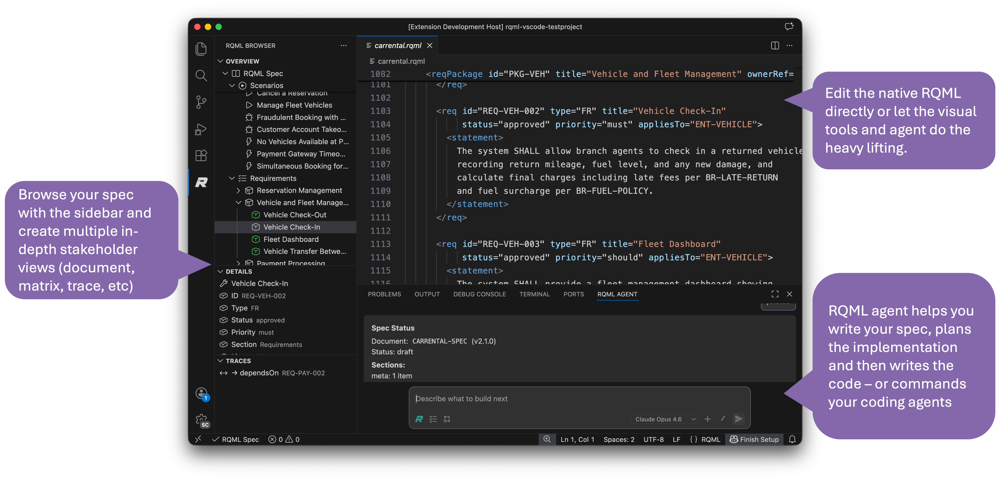
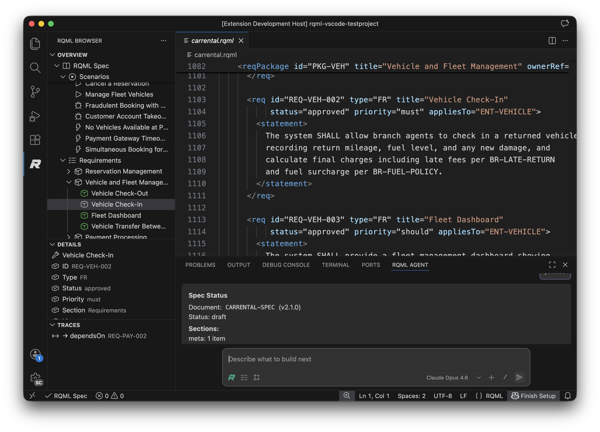
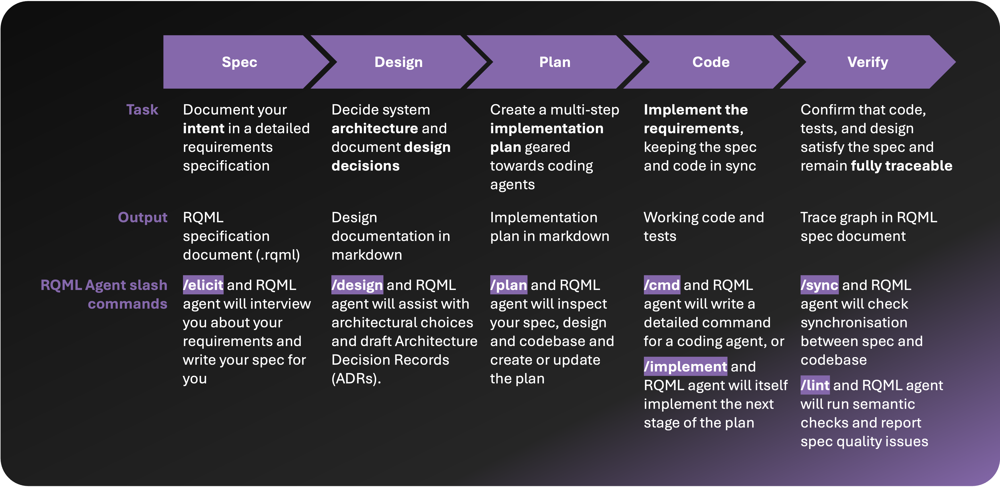
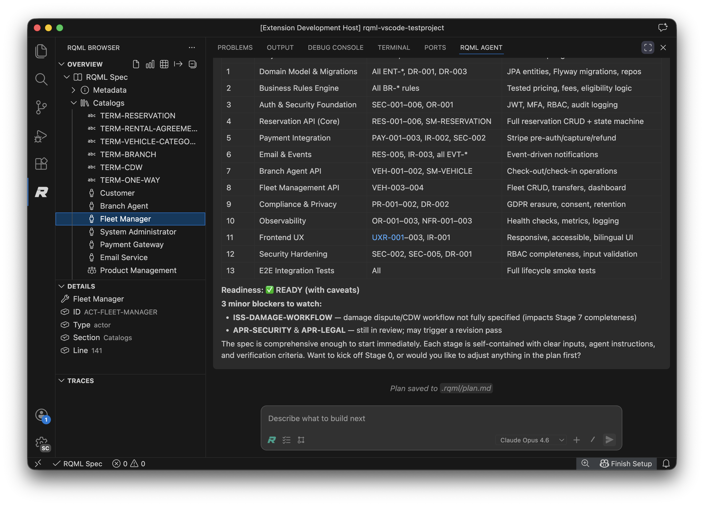
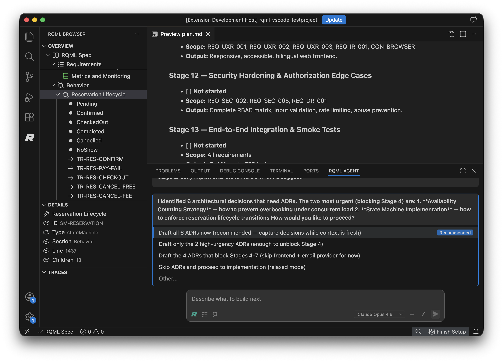
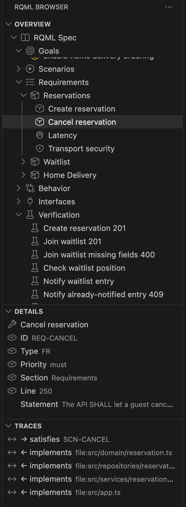
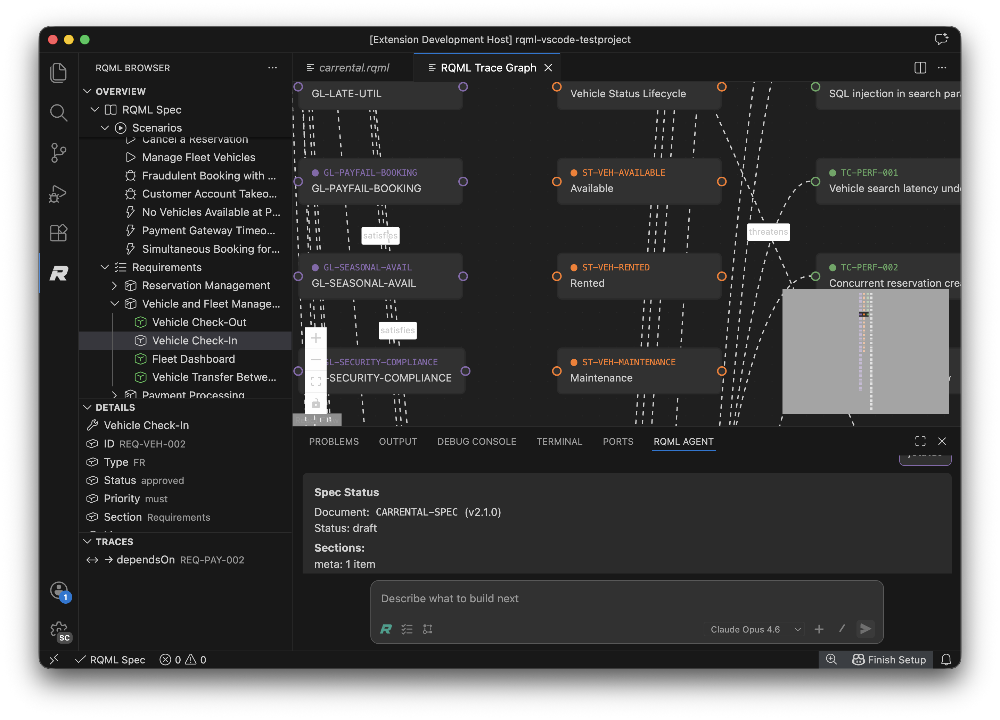
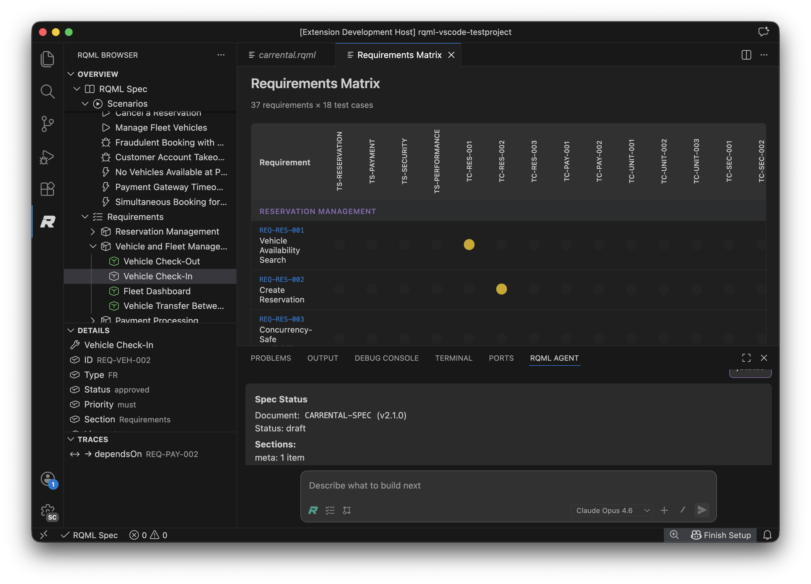
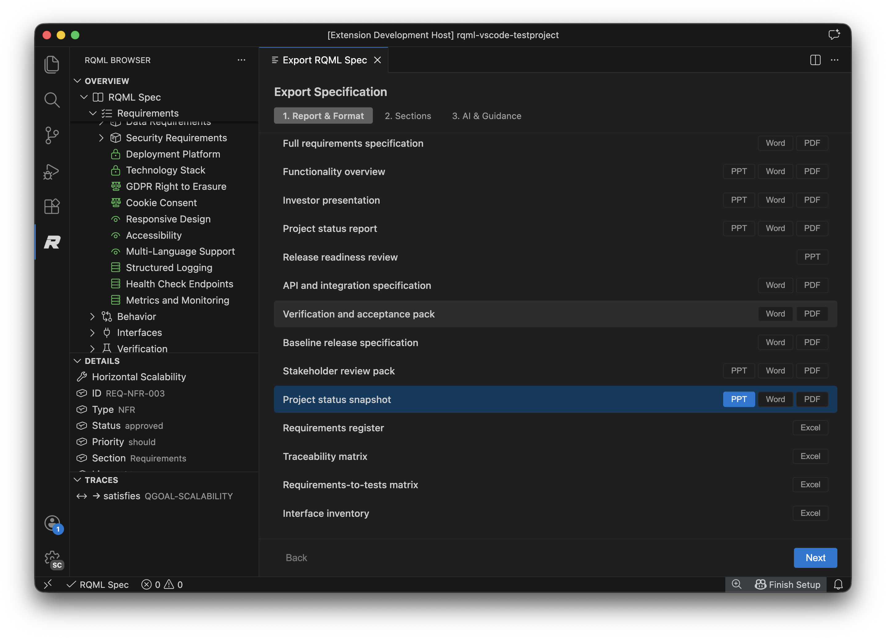

# RQML for Visual Studio Code

**Build from requirements, not from drifting prompts.**

The LLM era broke something. Code gets written faster than ever, but intent is slipping — scattered across chat logs, hallucinated into existence, or reconstructed after the fact from whatever the agent happened to do. RQML brings that intent back into your repository as a **living, versioned specification** that humans and coding agents both understand.



> **The missing piece in your LLM workflow.** Capture intent once. Reference it everywhere. Keep spec and code in sync across every session, every model, and every teammate.

<!-- [PLACEHOLDER: Short animated GIF showing /elicit → /plan → /implement flow would dramatically improve marketplace conversion. Create when time allows. Recommended: 8–15 seconds, looped.] -->

---

## The problem

Your coding agent writes code that looks right but drifts from what you meant. Each new session starts from scratch. Each teammate has a slightly different mental model. The spec — if one exists — lives in a Notion doc that nobody updates.

## The solution

RQML (**R**equirements Markup **L**anguage) is an LLM-first, human-readable specification format. One `.rqml` file in your repository becomes the durable source of truth for goals, requirements, design decisions, verification, and traceability.

This extension turns that file into a complete working environment:

- 🧭 **Navigate** large specs through a structured sidebar
- 🤖 **Collaborate** with an integrated LLM agent that enforces spec-first development
- 🔗 **Trace** every line of code back to the requirement that drove it
- 📄 **Export** stakeholder-ready documents in any format

---

## See it in action



*The RQML Browser (left), native `.rqml` editor (center), and RQML Agent (bottom) — working against a single source of truth.*

---

## The RQML development process

The extension guides you through a five-stage workflow that keeps spec, design, plan, code, and verification in sync.



| Stage | Slash command | What the agent does |
|---|---|---|
| **Spec** | `/elicit` | Interviews you and drafts a requirements specification |
| **Design** | `/design` | Assists with architectural choices and records them as ADRs |
| **Plan** | `/plan` | Inspects spec, design, and codebase to create or update a staged implementation plan |
| **Code** | `/cmd` or `/implement` | Writes a prompt for your coding agent of choice — or implements the next stage directly |
| **Verify** | `/sync`, `/lint` | Checks spec-code synchronisation and spec quality |

No more ad-hoc prompting. No more "I thought we agreed on X". No more losing the thread halfway through a feature.

---

## Key features

### 🤖 RQML Agent — your spec-first coding partner

An integrated LLM agent that lives in the VS Code panel and guides you through every stage of the process. It reads your spec, your ADRs, and your plan — so every response is grounded in the intent you've captured.



**Built-in support for:**
- Anthropic Claude, OpenAI GPT, Azure OpenAI, and Google Gemini
- Model switching mid-conversation
- File attachments for context
- Approval-gated tool calls for every code and spec change
- [Agent Skills](https://agentskills.io/) — extend the agent with company-wide coding standards, documentation formats, and domain expertise

### 🏛 Design decisions that survive

Capture architectural choices as Architecture Decision Records (ADRs) — stored as markdown in `.rqml/adr/`, classified, and traced back to the requirements that motivated them. Never lose the *why* behind a design again.



### 🧭 Structured specification browser

Navigate large specs without losing your place. The sidebar shows every RQML section — goals, requirements, scenarios, verification, traceability — with inline details and trace links for any selected item.



### 🔗 Visual traceability

Every requirement connects to goals, scenarios, tests, design decisions, and implementation. See the whole web at once, or follow a single thread:



### 📊 Requirements matrix

A birds-eye view of coverage, status, and priority across the entire spec. Perfect for verification reviews and finding gaps.



### 📤 Export to any format

Generate stakeholder-ready documents with one click. The export wizard offers 14+ report types (full spec, investor deck, release readiness review, traceability matrix, and more) in PDF, Word, PowerPoint, Excel, and Markdown — all with LLM-driven content generation.



### ✍️ Native RQML language support

Edit `.rqml` files with full syntax highlighting, real-time XSD validation, and Problems-panel diagnostics. Go-to-definition works from the tree view straight to the source line.

### ⚙️ Multi-spec, monorepo-aware

Supports multiple `.rqml` files in a single workspace. The extension discovers specs recursively, walks parent directories in monorepo setups, and lets you switch the active spec via the status bar.

---

## Quick start

1. **Install** the extension from the VS Code Marketplace.
2. **Open** your project in VS Code.
3. **Create a spec** — click *Create RQML Spec* in the RQML Browser sidebar, or run `RQML: Init Spec` from the Command Palette.
4. **Configure an LLM** — open the agent panel and run `/providers` to see your options, then `/keys set` to add your API key.
5. **Start the workflow** — type `/elicit` in the agent panel and describe what you want to build. The agent takes over from there.

A minimal `.rqml` file looks like this:

```xml
<rqml xmlns="https://rqml.org/schema/2.1.0" version="2.1.0" docId="DOC-001" status="draft">
  <meta>
    <title>My System</title>
    <system>my-system</system>
  </meta>
  <requirements>
    <req id="REQ-001" type="FR" title="Do the thing" status="draft" priority="must">
      <statement>The system SHALL do the thing.</statement>
    </req>
  </requirements>
</rqml>
```

---

## Who this is for

- **Teams building with coding agents** who need a source of truth that outlasts any single prompt.
- **Engineers** who want requirements, verification, and implementation tied together in version control.
- **Product-minded developers** who want system intent to live in the repository, not in Slack threads.
- **Projects that have outgrown prompt-only development** and need structure without heavyweight ALM tools.

---

## Requirements

- Visual Studio Code **1.108 or later**
- An LLM provider for agent features (Anthropic, OpenAI, Azure OpenAI, or Google) — *optional; the browser, language support, and export features work without one*
- Node.js runtime is bundled with the extension — no separate install needed

---

## Learn more

- 📘 **Documentation:** [rqml.dev](https://rqml.dev) — full user guide, development process, and reference
- 📐 **RQML Standard:** [rqml.org](https://rqml.org) — the specification format itself
- 🛠 **Source:** [github.com/rqml-org/rqml-vscode](https://github.com/rqml-org/rqml-vscode)
- 📚 **RQML Standard Repo:** [github.com/rqml-org/rqml](https://github.com/rqml-org/rqml)
- 🎓 **Agent Skills Standard:** [agentskills.io](https://agentskills.io/)

<!-- [PLACEHOLDER: Link to a 2-3 minute walkthrough video once recorded. Host on YouTube or Loom for reliable marketplace embedding.] -->

---

## Feedback

RQML is under active development. Ideas, bug reports, and pull requests are all welcome at the [GitHub repository](https://github.com/rqml-org/rqml-vscode/issues).

If spec-first development, LLM-assisted engineering, or traceable requirements in code repositories sounds like the way you want to work — install the extension and try it for 10 minutes. We'd love your feedback.

---

## License

MIT — see [LICENSE](https://github.com/rqml-org/rqml-vscode/blob/main/LICENSE) for details.
