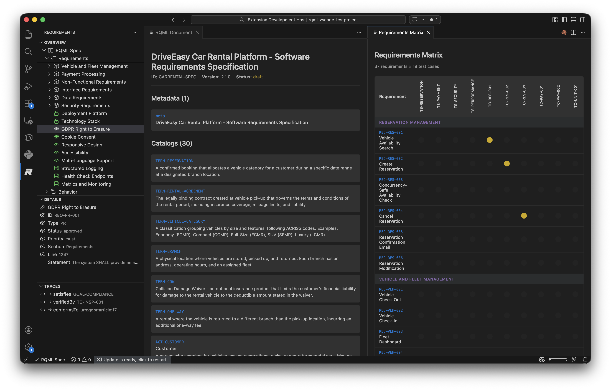
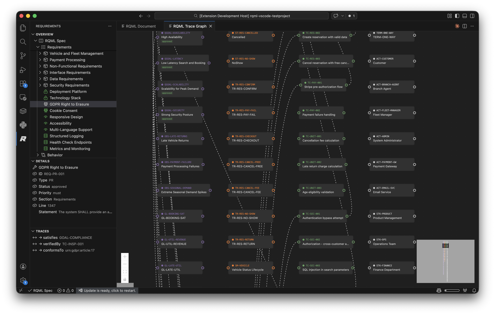
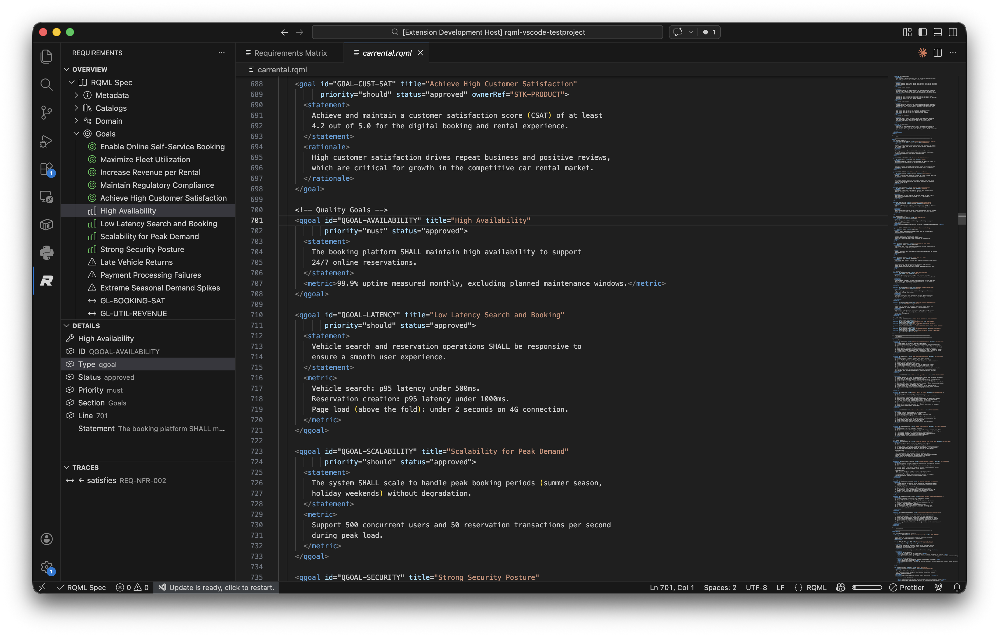
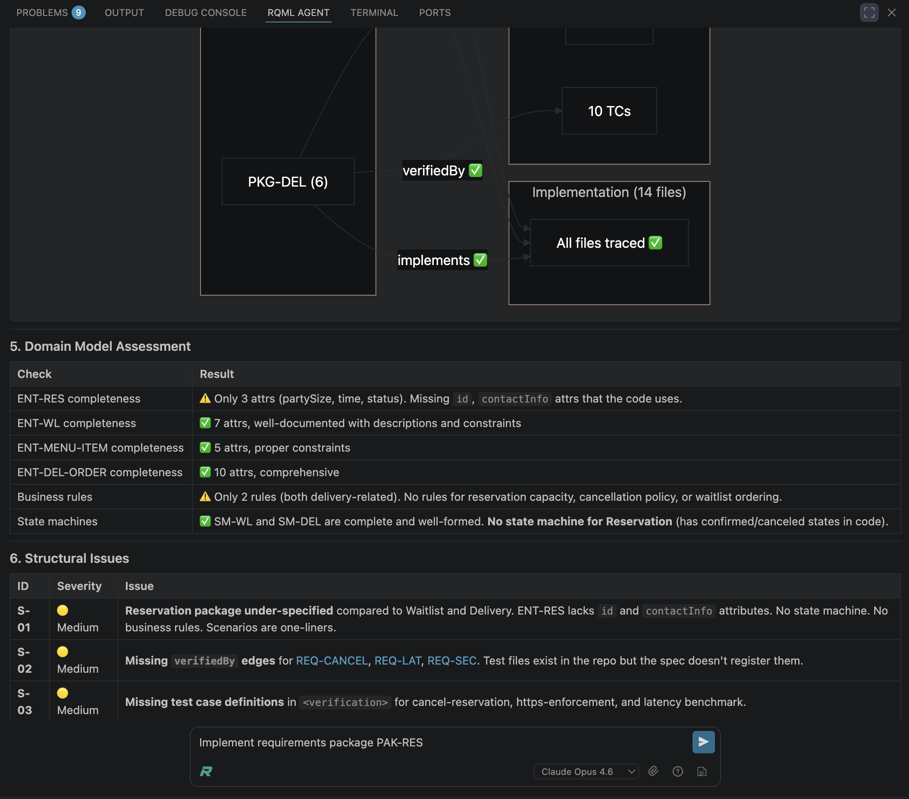

# RQML for Visual Studio Code

**Build from requirements, not from drifting prompts.**

RQML brings the **Requirements Markup Language** into Visual Studio Code so you can write, browse, review, trace, and evolve a living software requirements specification alongside your codebase.

Instead of leaving system intent scattered across chats, tickets, and tribal knowledge, RQML gives you a durable spec in the repository — one that works for both humans and coding agents.


## What is RQML?

RQML is a structured requirements format for modern software development. It is designed to be **LLM-first while still human readable**, so your project intent can live in version control as long-term engineering context.

Learn more:

- **Specification and docs:** [rqml.org](https://rqml.org)
- **Extension site:** [rqml.dev](https://rqml.dev)
- **RQML standard repository:** [github.com/rqml-org/rqml](https://github.com/rqml-org/rqml)
- **Extension repository:** [github.com/rqml-org/rqml-vscode](https://github.com/rqml-org/rqml-vscode)

## Why this extension?

You can edit `.rqml` files as text — but that is only part of the story.

This extension turns RQML into a practical working environment inside VS Code. It helps you move between raw source, stakeholder-friendly views, traceability, verification, and implementation planning without losing the thread.

Use it to:

- browse your specification from a dedicated sidebar
- work in native RQML language mode when you want full control
- switch between different stakeholder views of the same spec
- inspect details and trace links for any selected item
- understand coverage across goals, requirements, verification, and implementation
- use **RQML Agent** to improve specs, plan work, and drive coding-agent workflows

## Key features

### RQML Browser

Navigate the structure of your specification from a dedicated sidebar. Browse packages, requirements, goals, scenarios, interfaces, verification assets, traceability, and more.

The browser is designed to make large specs feel navigable rather than overwhelming.


### Multiple stakeholder views

Different audiences need different views of the same spec.

RQML for VS Code lets you work with views such as:

- **Document view** for readable spec review
- **Requirements matrix** for verification and coverage discussions
- **Trace graph** for relationships across goals, requirements, scenarios, tests, implementation, and stakeholders





### Native RQML editing

Work directly with your source when you want precision and control.

The extension includes built-in language support for `.rqml` files, while the surrounding views mean you do not need to live in raw XML all day.



### Details and traceability inspection

Select an item and inspect its metadata and relationships in context.

This makes it easier to review requirement IDs, types, status, priority, source location, and trace links such as:

- satisfies
- verifiedBy
- implements
- dependsOn
- conformsTo

That is useful for engineering reviews, implementation planning, and keeping code aligned with intent.

### RQML Agent

RQML Agent helps you turn a specification into forward motion.

It can help you:

- build out the spec structure
- assess specification quality
- identify missing coverage and structural gaps
- plan implementation from the spec
- generate commands and direction for coding agents



## Typical workflow

1. Create a single `.rqml` file in your project root.
2. Define goals, requirements, scenarios, verification, and traceability.
3. Review the spec through the browser, document view, matrix view, and trace graph.
4. Use RQML Agent to strengthen the spec and plan implementation.
5. Keep the spec and code in sync as the system evolves.

A common starting point is `requirements.rqml`, but a more descriptive root filename also works.

## Who this is for

RQML for VS Code is especially useful for:

- teams building with coding agents and wanting a stable source of truth
- engineers who want requirements, verification, and implementation tied together
- product-minded developers who want intent to live in the repository
- projects that have outgrown prompt-only development

## Getting started

1. Install the extension.
2. Open your project in VS Code.
3. Add a root `.rqml` file such as `requirements.rqml`.
4. Start small and grow the spec as the system grows.

A minimal RQML file can look like this:

```xml
<rqml xmlns="https://rqml.org/schema/2.1.0" version="2.1.0" docId="DOC-001" status="draft">
  <meta>
    <title>My System</title>
    <system>my-system</system>
  </meta>
  <requirements>
    <req id="REQ-001" type="FR" title="Do the thing" status="draft" priority="must">
      <statement>The system SHALL do the thing.</statement>
    </req>
  </requirements>
</rqml>
```

## Philosophy

RQML is built around a simple idea:

**intent should be first-class project context.**

Not hidden in chat logs.
Not trapped in tickets.
Not inferred only from code after the fact.

The extension exists to make that way of working practical inside VS Code.

## Documentation and links

- **RQML website:** [rqml.org](https://rqml.org)
- **Extension website:** [rqml.dev](https://rqml.dev)
- **Standard repository:** [github.com/rqml-org/rqml](https://github.com/rqml-org/rqml)
- **Extension repository:** [github.com/rqml-org/rqml-vscode](https://github.com/rqml-org/rqml-vscode)

## Feedback and issues

Ideas, issues, and contributions are welcome in the GitHub repositories.

If you are exploring spec-first development, LLM-assisted engineering, or traceable requirements in code repositories, RQML is built for exactly that workflow.
