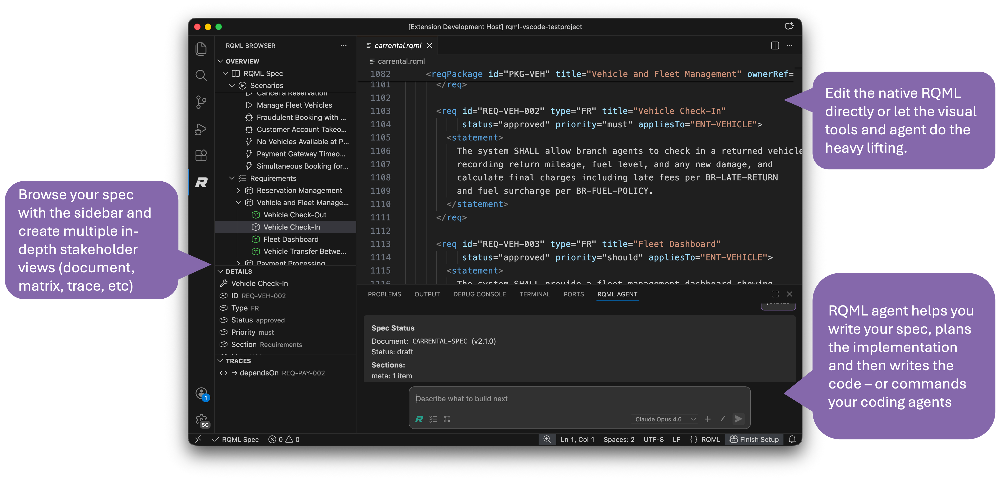
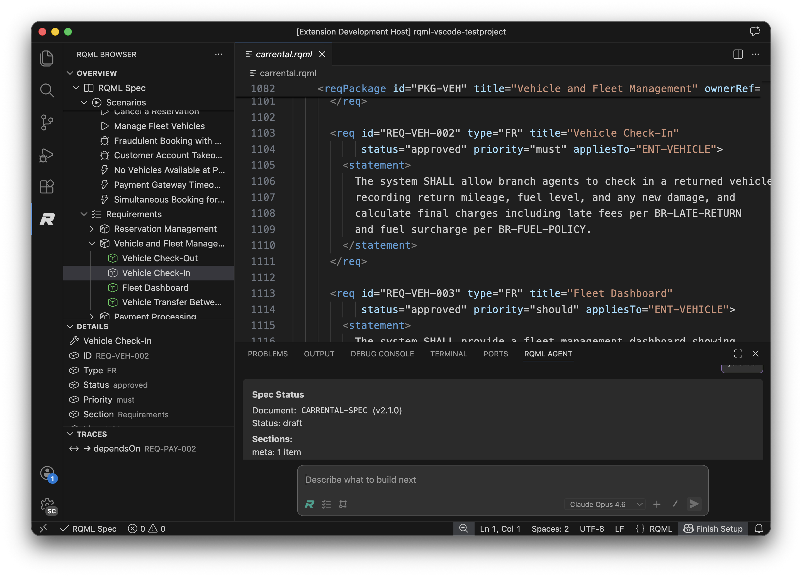
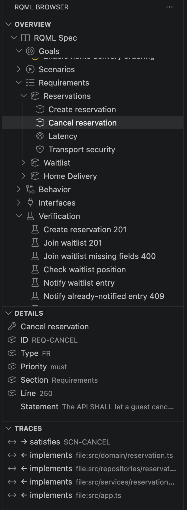
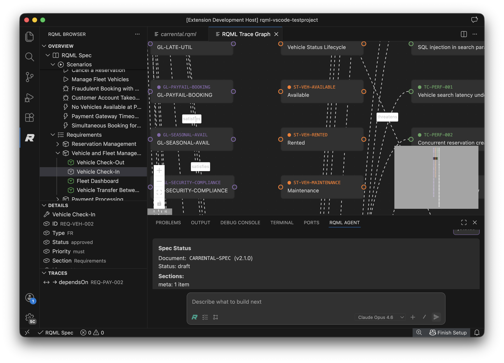
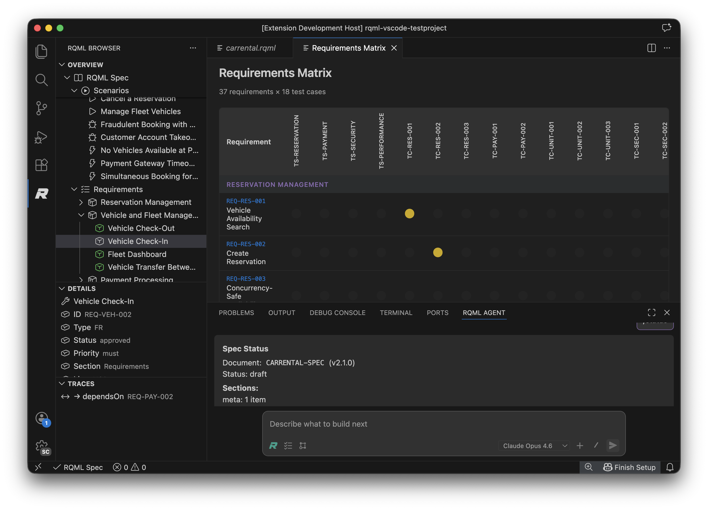
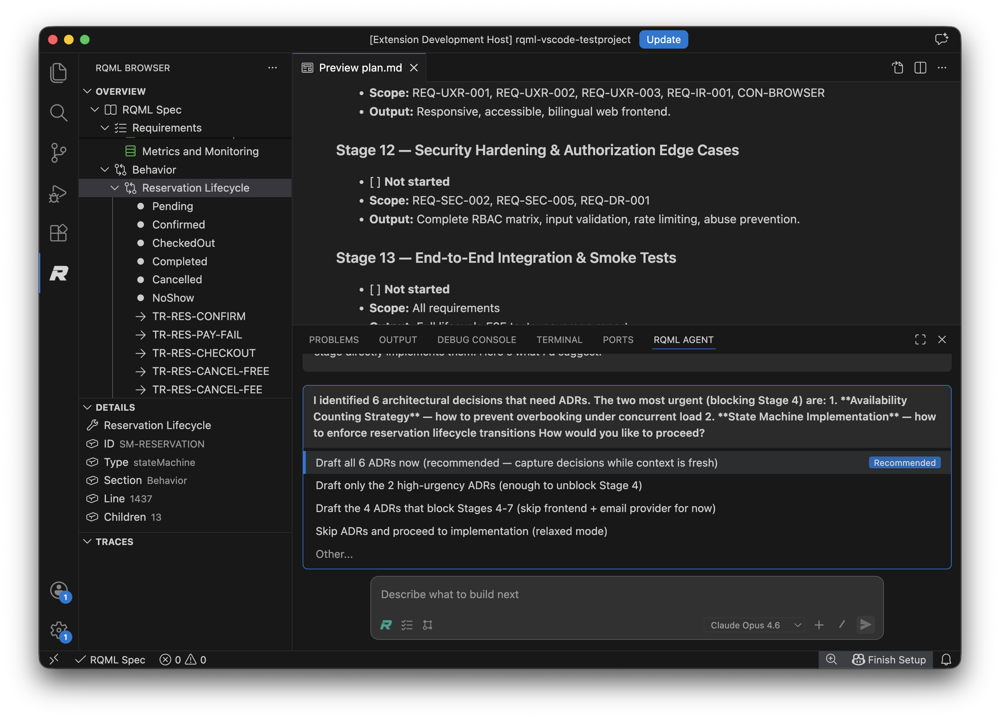
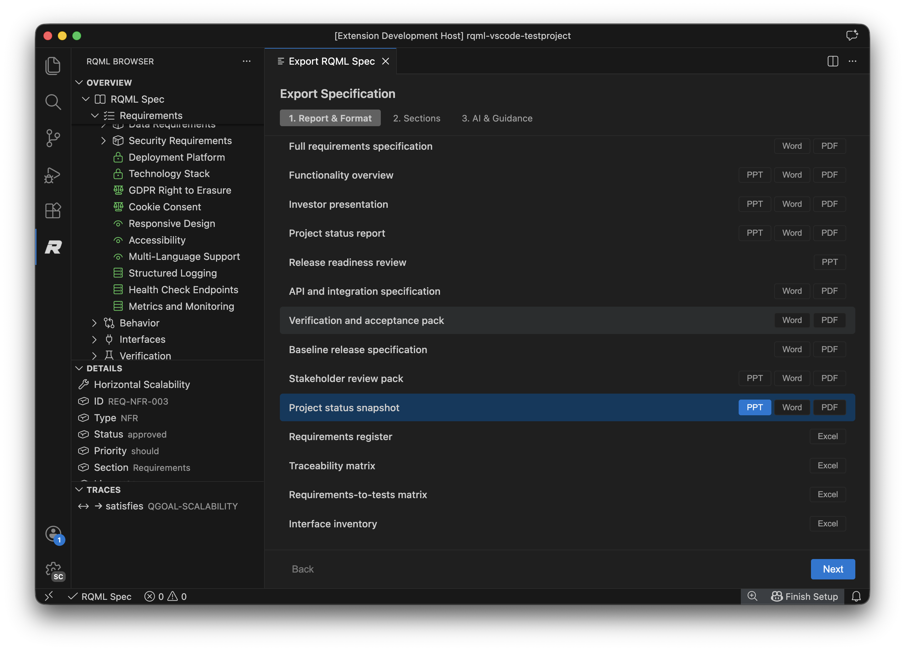

# RQML for Visual Studio Code

**Your agent changed the code. Did it change what you meant?**

Coding agents produce a lot of code very quickly. What they don't produce is a durable record of intent — that ends up scattered across chat logs, or reconstructed after the fact from whatever the agent happened to do. RQML keeps intent in the repository as a structured, versioned specification, so the question "does the code still match what we agreed?" has an answer you can check instead of a feeling you have.

This extension is the editor-side view of that specification: browse it, follow its traces, read its coverage, and edit it with live validation.



---

## The problem

An agent writes code that looks right but drifts from what you meant. The next session starts from scratch. Each teammate carries a slightly different mental model. The spec — if one exists — lives in a document nobody updates, so nothing ever catches the divergence.

## The approach

RQML (**R**equirements Markup **L**anguage) is a human-readable specification format designed to be read and written by both people and coding agents. One `requirements.rqml` file in your repository holds goals, requirements, acceptance criteria, design decisions, verification, and the trace links between them and your code.

Because it is a file in version control, it diffs, it reviews, and it can be checked by a machine. The [`@rqml/cli`](https://www.npmjs.com/package/@rqml/cli) tool is what enforces in CI — `rqml check` exits non-zero when the specification and the codebase disagree. This extension is where a human reads that same picture while working.

- 🧭 **Navigate** large specifications through a structured sidebar
- 🔗 **Trace** requirements to goals, scenarios, tests, decisions, and code
- 📊 **Review** coverage, status, and gaps in a requirements matrix
- ✍️ **Edit** `.rqml` natively, with schema validation in the Problems panel
- 📤 **Export** stakeholder-ready documents for review and audit

---

## See it in action



*The RQML Browser (left), native `.rqml` editor (center), and RQML Agent (bottom) — working against a single source of truth.*

---

## What you get

### 🛡 The gate, and exactly what it covers

The status bar carries a verdict for the active specification: schema validation
and referential integrity, trace coverage, and whether any implementation has
changed since its trace edge was recorded. Findings appear in the Problems
panel, and a drifted edge offers a one-click re-pin once you have reviewed the
change.

That verdict is computed by the same engine as `rqml check`, composed the same
way, with no language model involved — so the editor and your build cannot
disagree, and the verdict works offline with nothing configured.

**What is blocked, and what is not.** Be clear on this before you rely on it:

| | |
|---|---|
| Writes by this extension's built-in agent | **Blocked** when they target a non-approved requirement, if you enable `rqml.gate.blockAgentEdits` (off by default) |
| Your own edits, another extension's edits, an agent in the terminal | **Reported, not blocked** |
| `rqml check` in continuous integration | **Authoritative** — the layer nothing bypasses |

No VS Code extension can veto a file save, a file-system operation, or another
extension's tool call; the editor offers no interception point for any of them.
So this extension tells you the truth about your repository rather than
pretending to police it. Put `npx @rqml/cli check` in CI — that is the gate that
actually holds.

### 🤝 Works with the agent you already use

The extension registers the RQML MCP server for you, so GitHub Copilot's agent
mode — or any agent that speaks MCP — gets the whole toolchain: `rqml_check`,
`rqml_show`, `rqml_impact`, `rqml_link` and nine more. No configuration; the
server is scoped automatically to the specification governing what you are
working on, so in a monorepo it follows you between units.

Two further tools cover what a separate process cannot see: which specification
governs the file you have open, and the gate verdict for **unsaved** changes —
`rqml_check` reads from disk, so while an agent is editing a specification it
would otherwise be answering about a stale file.

VS Code asks you to trust the server the first time it starts. That prompt is
the platform's, and this extension cannot pre-approve it on your behalf.

None of this blocks anything. It gives your agent the same answers the editor
has; enforcement remains as described above.

### 🧭 Structured specification browser

Navigate large specifications without losing your place. The sidebar shows every RQML section — goals, requirements, scenarios, verification, traceability — with inline details and trace links for any selected item.



### 🔗 Visual traceability

Every requirement connects to goals, scenarios, tests, design decisions, and implementation. See the whole graph at once, or follow a single thread from a requirement to the code that implements it.



### 📊 Requirements matrix

Coverage, status, and priority across the entire specification, in one view. This is the artifact to open in a verification review, and the fastest way to find requirements that nothing implements and nothing tests.



### 🏛 Design decisions that survive

Capture architectural choices as Architecture Decision Records — stored as markdown in `.rqml/adr/`, classified, and traced back to the requirements that motivated them. The *why* behind a design stays in the repository next to the design.



### ✍️ Native RQML language support

Edit `.rqml` files with syntax highlighting, XSD schema validation, and Problems-panel diagnostics. Go-to-definition works from the tree view straight to the source line.

### ⚙️ Multi-spec, monorepo-aware

Supports multiple `.rqml` files in one workspace. The extension discovers specifications across the workspace, searches parent directories to find the one governing the file you are editing, and lets you switch the active specification from the status bar.

### 📤 Export for review

Generate documents for people who will never open VS Code. The export wizard offers report types from full specification to traceability matrix and release-readiness review, in PDF, Word, PowerPoint, Excel, and Markdown. Report content is generated with a configured language model.



### 🤖 Built-in agent (optional)

The extension also ships an integrated agent panel that can draft requirements, record decisions, and plan implementation against your specification. It is entirely optional: the browser, traceability, matrix, and language support all work without configuring any model.

If you already work with GitHub Copilot, Claude Code, or another coding agent, you can ignore the panel and use this extension purely as the oversight surface for what those agents do.

Supported providers: Anthropic, OpenAI, Azure OpenAI, Google, xAI, Mistral, Groq,
DeepSeek, and Perplexity — each with your own key, talking to that vendor directly.

You can also select the **Vercel AI Gateway**, which reaches many models through
a single key. It is never the default and never selected for you. Choosing it
means your prompts — including specification content — are routed through
Vercel, so it is offered as a deliberate choice rather than a recommendation.
Vercel's zero-retention guarantee is plan-gated on their side and is not the
default routing behaviour, so if retention matters to you, check your account
before selecting it.

Nothing else changes if you ignore it: the specification browser, traceability,
matrix, gate and export never contact a model or a network at all.

---

## Quick start

1. **Install** the extension from the VS Code Marketplace.
2. **Open** your project in VS Code.
3. **Create a specification** — click *Create RQML Spec* in the RQML Browser sidebar, or run `RQML: Init Spec` from the Command Palette.
4. **Browse and trace** — the sidebar, traceability map, and matrix all work immediately, with no model configured.
5. *(Optional)* **Configure a model** — open the agent panel and run `/providers`, then `/keys set` to add an API key.

A minimal specification looks like this:

```xml
<rqml xmlns="https://rqml.org/schema/2.2.0" version="2.2.0" docId="DOC-001" status="draft">
  <meta>
    <title>My System</title>
    <system>my-system</system>
  </meta>
  <requirements>
    <req id="REQ-001" type="FR" title="Do the thing" status="draft" priority="must">
      <statement>The system SHALL do the thing.</statement>
    </req>
  </requirements>
  <trace>
    <edge id="E-001" type="implements" from="src/thing.ts" to="REQ-001"/>
  </trace>
</rqml>
```

Schema versions 2.0.1, 2.1.0 and 2.2.0 are all readable; new specifications are
created at 2.2.0, and `npx @rqml/cli migrate` upgrades an older one in place.

To enforce the same rules in CI, add the command-line tool:

```bash
npx @rqml/cli check
```

---

## Who this is for

- **Teams working with coding agents** who need a record of intent that outlasts any single session.
- **Engineers** who want requirements, verification, and implementation tied together in version control.
- **Regulated and safety-critical projects** that need traceability evidence as a reviewable artifact rather than a document assembled at audit time.
- **Projects that have outgrown prompt-only development** and want structure without a heavyweight ALM tool.

---

## Requirements

- Visual Studio Code **1.108 or later**
- A language model provider is **optional** — required only for the agent panel and for export report generation. The specification browser, traceability map, requirements matrix, and `.rqml` language support all work without one.

---

## Learn more

- 📘 **Documentation:** [rqml.dev](https://rqml.dev) — user guide, development process, and reference
- 📐 **RQML standard:** [rqml.org](https://rqml.org) — the specification format itself
- 🛠 **Command-line tool:** [`@rqml/cli`](https://www.npmjs.com/package/@rqml/cli) — the same checks, in CI
- 💻 **Source:** [github.com/rqml-org/rqml-vscode](https://github.com/rqml-org/rqml-vscode)
- 📚 **Standard repository:** [github.com/rqml-org/rqml](https://github.com/rqml-org/rqml)

---

## Feedback

RQML is under active development. Ideas, bug reports, and pull requests are all welcome at the [GitHub repository](https://github.com/rqml-org/rqml-vscode/issues).

---

## License

MIT — see [LICENSE](https://github.com/rqml-org/rqml-vscode/blob/main/extension/LICENSE) for details.
